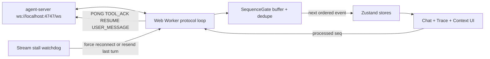
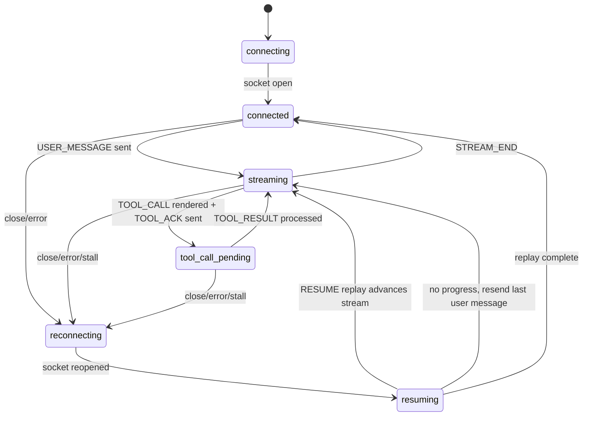

# Agent Console Alchemyst

A Next.js agent console for the Alchemyst full-stack assignment. The frontend treats the WebSocket stream as a distributed-systems problem: ordering, heartbeats, reconnect/resume, trace inspection, and large context diffs are handled explicitly instead of hidden inside a chat component.

The protocol loop runs in a Web Worker, emits only ordered/deduped events into React, and advances `RESUME.last_seq` only after React confirms the UI consumed a `seq`.

> [!IMPORTANT]
> `apps/agent-server` was treated as read-only. In chaos mode it can abort the active script after a drop, so `RESUME` can replay already-generated history but cannot create missing future tokens; the client resends the last user message when resume makes no stream progress.

## Architecture


## Connection State Machine


## Run Locally
Prerequisites: Docker, Bun `1.3.4+`, Node.js `20+`.

Start the mock server:
```bash
cd apps/agent-server
docker build -t agent-server .
docker run -p 4747:4747 agent-server
```

Run chaos mode:
```bash
cd apps/agent-server
docker run -p 4747:4747 agent-server --mode chaos
```

Start the web app from the repo root:
```bash
bun install
bun run dev:web
```
Open `http://localhost:3001`.

Build and start production:
```bash
bun install
npm run build
npm run start
```

Check protocol logs:
```bash
curl -s http://localhost:4747/log | python3 -m json.tool
```
## Submission Media
Normal-mode screenshots:
### Streamed response with tool call


### Trace timeline


### Context inspector diff


Chaos-mode recording:
YouTube/Loom: https://youtu.be/dA4lSnbTh2s

The recording should label connection drop, out-of-order handling, sequential tool calls, oversized context, and corrupt heartbeat behavior. True continuation after an aborted chaos stream is limited by the fixed mock server; see [DECISIONS.md](DECISIONS.md).

## Implementation Notes
- `apps/web/src/worker/agent-worker.ts` owns socket lifecycle, heartbeats, tool ACKs, resume, and resend recovery.
- `apps/web/src/worker/sequence-gate.ts` owns ordered delivery and deduplication.
- `apps/web/src/worker/stream-stall-watchdog.ts` detects streams that reconnect but stop producing ordered progress.
- `apps/web/src/store/chat-store.ts` keeps text and tool cards as ordered parts so tool calls do not overwrite streamed text.
- `apps/web/src/store/trace-store.ts` groups token frames into expandable rows.
- `apps/web/src/components/context/context-panel.tsx` uses `@uiw/react-json-view` for normal JSON and `virtual-react-json-diff` for large diffs, because the non-virtual diff path blocked the main thread on very large second comparisons.

## Design Decisions
Detailed tradeoffs are in [DECISIONS.md](DECISIONS.md), including why `RESUME` is insufficient for this mock server after an aborted chaos stream and why the last user message is resent as a practical workaround.
