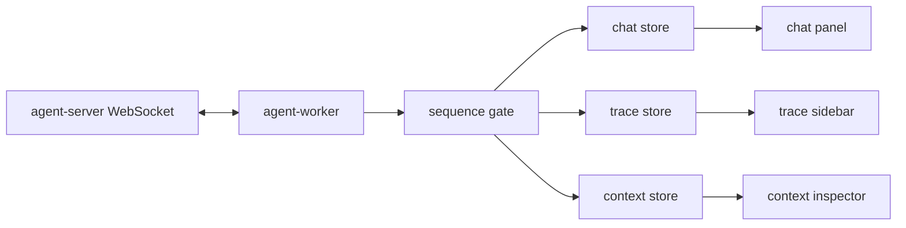
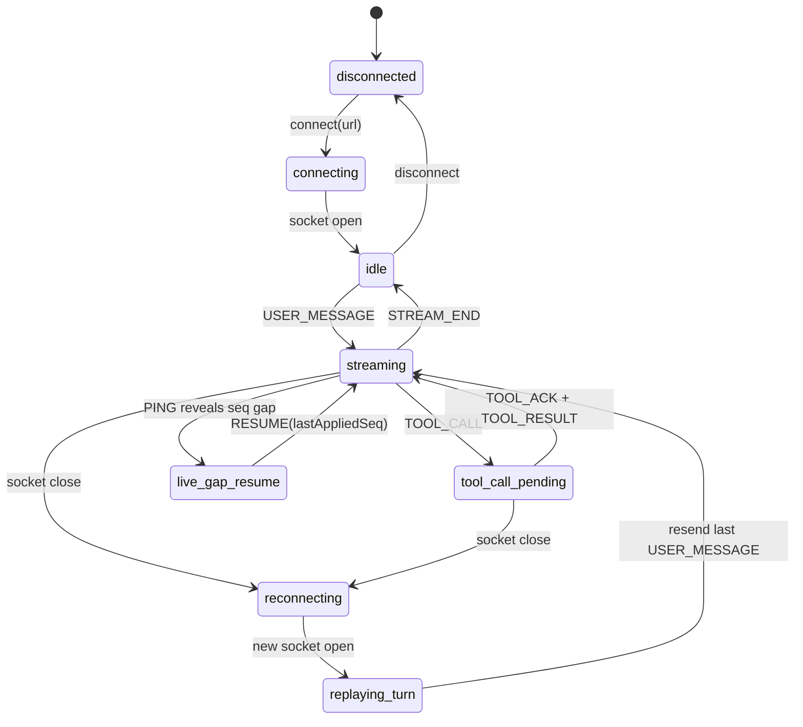

# Agent Console Alchemyst

A Next.js Agent Console for the Alchemyst full-stack assignment. The frontend connects to the provided WebSocket agent server, streams assistant tokens, renders tool calls/results, tracks protocol events in a virtualized trace panel, and inspects context snapshots with diff history.

The protocol handling is intentionally kept in a Web Worker: incoming frames are validated with Zod, reordered/deduplicated by sequence number, and then applied to small Zustand stores for chat, trace, and context UI. See [DECISIONS.md](./DECISIONS.md) for the important reconnect tradeoff: this mock backend aborts generation on reconnect, so the client replays the active user turn to recover a complete answer instead of pretending `RESUME` can continue an aborted script.

> [!NOTE]
> `apps/agent-server` is the provided backend. It is read for protocol behavior, but not edited.

## Youtube Demo 

https://youtu.be/8bsGGsMPEAo

- Note: Timestamps are in the description due to pending advanced feature verification from youtube

## Screenshots

Add the normal-mode screenshots required by the assignment before submission:

| View | File |
| --- | --- |
| Streamed response with a tool call |  |
| Trace timeline |  |
| Context inspector diff |  |

## Features

- Incremental token rendering over WebSockets.
- Tool call cards keyed by `call_id`, with `TOOL_ACK` sent from the UI path.
- Worker-side sequence gate for out-of-order and duplicate server messages.
- Immediate `PONG` responses, including corrupt empty heartbeat challenges.
- Virtualized trace sidebar with token grouping, search, and event type filters.
- Context inspector with JSON tree rendering, diff view, and snapshot navigation.
- Chaos-mode reconnect fallback that rewinds the active chat turn and resends the last user message.

## Architecture



The worker is the protocol boundary. It parses unknown frames, sends heartbeat replies, buffers out-of-order messages until they are contiguous, drops duplicates, and emits state patches. React stays focused on rendering and interaction.

## Connection State Machine



## Prerequisites

- Node.js 20+
- Docker, for the provided backend container

## Run Locally

Install dependencies:

```bash
npm i
```

Build and run the provided agent server in normal mode:

```bash
docker build -t agent-server ./apps/agent-server
docker run -p 4747:4747 agent-server
```

In another terminal, start the web app:

```bash
npm run build && npm run start
```

Open:

```text
http://localhost:3001
```

The frontend defaults to:

```text
ws://localhost:4747/ws
```

To point it at a different backend, set `NEXT_PUBLIC_AGENT_WS_URL`.

## Chaos Mode

Run the backend with chaos enabled:

```bash
docker run -p 4747:4747 agent-server --mode chaos
```

Useful prompt keywords from the backend:

| Prompt keyword | Scenario |
| --- | --- |
| `hello` | Basic token stream |
| `report`, `summary`, `q3` | Tool call plus context updates |
| `analyze`, `compare` | Sequential tool calls |
| `lookup`, `find`, `search` | Tool call before tokens |
| `schema`, `database`, `large` | Oversized context snapshot |
| `long`, `detailed`, `document` | Long response stream |

Check backend protocol logs:

```bash
curl -s http://localhost:4747/log
```

Reset backend state:

```bash
curl -s http://localhost:4747/reset
```

## Project Layout

```text
apps/
  agent-server/   Provided WebSocket backend
  web/            Next.js Agent Console
packages/
  env/            Typed environment config
  ui/             Shared UI components
assignment/       Original assignment docs and failure-mode notes
```

## Scripts

| Command | Description |
| --- | --- |
| `npm run dev:web` | Start the Next.js app on port 3001 |
| `npm run build` | Build workspace packages/apps |
| `npm run start` | Start the built web app |
| `npm run test` | Run the web app Vitest suite |

## Submission Notes

- `DECISIONS.md` documents the protocol tradeoffs and known backend failure modes.
- The chaos-mode screen recording is still a required external submission asset.
- The backend `/log` endpoint is the source of truth for `PONG`, `TOOL_ACK`, `RESUME`, and protocol violation records.
